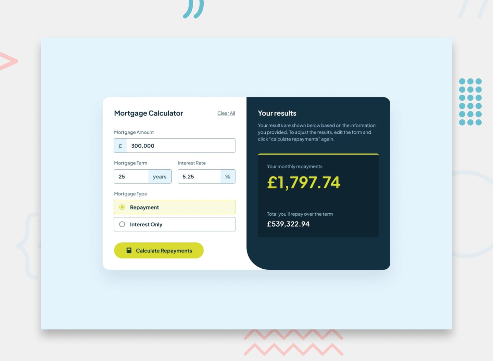

<div align="center">

# 🏡 Mortgage Repayment Calculator

### Um desafio do [Frontend Mentor](https://www.frontendmentor.io) resolvido com HTML, CSS, JavaScript, Sass, Bootstrap, Vite e muito cuidado com acessibilidade.

<br />

[](https://mortgage-repayment-calculator-gamma.vercel.app/)
[](https://www.frontendmentor.io/challenges/mortgage-repayment-calculator-Galx1LXK73)
[](https://www.frontendmentor.io/profile/anaClarissi)
[](https://www.linkedin.com/in/anaclarissi)

</div>

<br />

<div align="center">
  
</div>

<br />

## 📌 Sobre o projeto

Este é a minha solução para o desafio **Mortgage Repayment Calculator** do Frontend Mentor: uma calculadora de financiamento imobiliário que permite ao usuário inserir o valor do empréstimo, o prazo em anos, a taxa de juros e o tipo de mortgage (*Repayment* ou *Interest Only*), retornando o valor da parcela mensal e o total pago ao longo do prazo.

Mais do que reproduzir o design pixel a pixel, meu foco aqui foi em **construir uma experiência de formulário robusta**: validação sem recarregar a página, mensagens de erro acessíveis para leitores de tela, estados visuais claros de hover/focus/erro, e um cálculo matemático correto por trás dos resultados.

> 🔗 **Site ao vivo:** [mortgage-repayment-calculator-gamma.vercel.app](https://mortgage-repayment-calculator-gamma.vercel.app/)

<br />

## 🧭 Sumário

- [Funcionalidades](#-funcionalidades)
- [Tecnologias utilizadas](#️-tecnologias-utilizadas)
- [Como o projeto foi construído](#-como-o-projeto-foi-construído)
- [Acessibilidade](#-acessibilidade)
- [Estados de interação (hover, focus e erro)](#-estados-de-interação-hover-focus-e-erro)
- [A fórmula do cálculo](#-a-fórmula-do-cálculo)
- [Principais aprendizados](#-principais-aprendizados)
- [Rodando o projeto localmente](#-rodando-o-projeto-localmente)
- [Autora](#-autora)

<br />

## ✨ Funcionalidades

- 📝 Preenchimento do valor do empréstimo, prazo (anos), taxa de juros e tipo de mortgage
- 🧮 Cálculo em tempo real do **repayment mensal** e do **total pago ao longo do prazo**
- ⚠️ Validação completa do formulário **sem recarregar a página**, com mensagens de erro específicas para cada campo
- ♿ Mensagens de erro acessíveis, anunciadas por leitores de tela via `aria-live`
- 🧹 Botão **Clear All** para resetar o formulário
- 🎯 Navegação e preenchimento 100% possíveis apenas via teclado
- 📱 Layout responsivo, adaptado para mobile e desktop
- 🖱️ Estados visuais de hover, focus e erro em todos os elementos interativos

<br />

## 🛠️ Tecnologias utilizadas

<div align="center">

| Tecnologia | Uso no projeto |
|---|---|
|  | Estrutura semântica do formulário e da página, com foco em acessibilidade |
|  | Estilização responsiva, `clamp()` para tipografia fluida, seletores modernos como `:has()` e `:placeholder-shown` |
|  | Estrutura de arquivo `_sass.scss` preparada para futuras refatorações e organização em partials |
|  | Toda a lógica de validação, cálculo do mortgage e manipulação do DOM |
|  | Utilizado como base de suporte no bundle JS do projeto |
|  | Bundler e ambiente de desenvolvimento, com hot reload e build otimizado |

</div>

<br />

## 🏗️ Como o site foi construído

O projeto foi organizado em módulos separados por responsabilidade, todos importados a partir de um `main.js` central:

```
src/
├── js/
│   ├── main.js      → ponto de entrada, importa estilos e módulos
│   └── form.js       → toda a lógica de validação e cálculo do formulário
├── scss/
│   └── _sass.scss    → preparado para estilos futuros em Sass
└── css/
    └── style.css      → estilos principais do projeto, com variáveis CSS
```

**Algumas decisões técnicas do processo:**

- **Variáveis CSS (`:root`)** para toda a paleta de cores e tokens de design, facilitando manutenção e consistência entre os componentes.
- **`novalidate` no formulário** combinado com validação manual em JavaScript, permitindo controle total sobre quando e como as mensagens de erro aparecem, no lugar dos balões de validação nativos do navegador.
- **Seletores CSS modernos** como `:has()` para estilizar o container do input com base no estado do input filho (ex: quando ele não está vazio, ou quando está com foco), evitando a necessidade de classes adicionadas via JS só para estilo.
- **Cálculo isolado em funções puras** (`calculateMortgageMonth` e `calculateMortgageYear`), separando claramente a lógica de negócio da manipulação do DOM.
- **Vite** como bundler, permitindo importar Sass, CSS e JS de forma modular, com build rápido e otimizado para produção.

<br />

## ♿ Acessibilidade

A acessibilidade foi um dos pontos que mais me dediquei nesse desafio. Entre as decisões tomadas:

- Cada input possui `aria-describedby` apontando para sua respectiva mensagem de erro, e `aria-invalid` atualizado dinamicamente conforme a validação.
- O grupo de radios (*Mortgage Type*) é agrupado semanticamente com `<fieldset>` e `<legend>`, com a mensagem de erro associada ao `fieldset` — já que o erro pertence ao grupo como um todo, e não a um radio individual.
- As mensagens de erro usam `aria-live="polite"`, garantindo que leitores de tela anunciem o erro sem interromper abruptamente o fluxo do usuário.
- Toda a seção de resultados usa `aria-live="polite"` para anunciar os valores calculados assim que aparecem.
- O formulário é 100% navegável e preenchível apenas com o teclado, incluindo estados de `:focus` visíveis em todos os campos, radios e botões.
- Ícones puramente decorativos (como o do botão de calcular) recebem `alt=""` e `aria-hidden="true"`, para não gerar ruído desnecessário na leitura por leitores de tela.

<br />

## 🎨 Estados de interação (hover, focus e erro)

Todos os elementos interativos do formulário possuem estados visuais claros e consistentes:

- **Hover:** inputs, radios e botões reagem visualmente ao passar o mouse, reforçando que são elementos clicáveis/editáveis.
- **Focus:** cada campo recebe um `outline` customizado ao ser focado via teclado (Tab), com transições suaves entre os estados, mantendo a navegação por teclado clara e visível em todo momento.
- **Preenchido:** os campos de valor mudam sutilmente de cor de borda e do símbolo (£, %, years) quando já possuem conteúdo digitado, usando `:has()` + `:placeholder-shown` — sem depender de JavaScript para esse efeito puramente visual.
- **Erro:** quando um campo é inválido, sua borda e o símbolo mudam para a cor de erro, e a mensagem correspondente aparece logo abaixo, com `role`/`aria-live` garantindo que a informação também chegue a quem usa leitor de tela.
- **Radio selecionado:** o radio marcado destaca todo o seu container (`.radio-col`) com uma cor de fundo e borda diferenciadas, deixando a seleção óbvia visualmente.

<br />

## 🧮 A fórmula do cálculo

A parte que mais me desafiou tecnicamente foi entender e implementar corretamente a fórmula de amortização de um mortgage do tipo *Repayment*:

```
M = P × [ r(1+r)ⁿ ] / [ (1+r)ⁿ − 1 ]
```

Onde `M` é o valor da parcela mensal, `P` é o valor principal do empréstimo, `r` é a taxa de juros mensal e `n` é o número total de parcelas. Para o tipo *Interest Only*, o cálculo é mais simples, considerando apenas os juros sobre o principal em cada mês.

Para entender a derivação matemática completa por trás dessa fórmula, usei como referência o excelente artigo:

📖 [Deriving the Mortgage Payment Formula — jessym.com](https://www.jessym.com/articles/deriving-the-mortgage-payment-formula)

<br />

## 💡 Principais aprendizados

- Aprofundamento em **seletores CSS modernos** (`:has()`, `:placeholder-shown`) para resolver problemas de estilo que antes eu resolveria só com JavaScript.
- Entendimento mais sólido sobre **acessibilidade em formulários**: a diferença entre `aria-live="polite"` e `role="alert"`, como agrupar corretamente inputs relacionados com `fieldset`/`legend`, e como associar mensagens de erro aos campos corretos.
- Prática de **validação de formulário manual**, sem depender da validação nativa do navegador, mantendo controle total sobre UX e mensagens customizadas.
- Aplicação de uma **fórmula financeira real** em JavaScript, incluindo o cuidado de converter taxas anuais para mensais corretamente.
- Organização de um projeto **modular com Vite**, separando responsabilidades entre HTML, CSS, Sass e JS de forma limpa.

<br />

## 🚀 Rodando o projeto localmente

```bash
# Clone o repositório
git clone https://github.com/anaClarissi/mortgage-repayment-calculator

# Acesse a pasta do projeto
cd mortgage-repayment-calculator

# Instale as dependências
npm install

# Rode o projeto em ambiente de desenvolvimento
npm run dev
```

<br />

## 👩‍💻 Autora

<div align="center">

**Ana Clarissi**

[](https://www.frontendmentor.io/profile/anaClarissi)
[](https://www.linkedin.com/in/anaclarissi)

</div>

<br />

<div align="center">

Feito com 💛 e muita atenção aos detalhes.

</div>